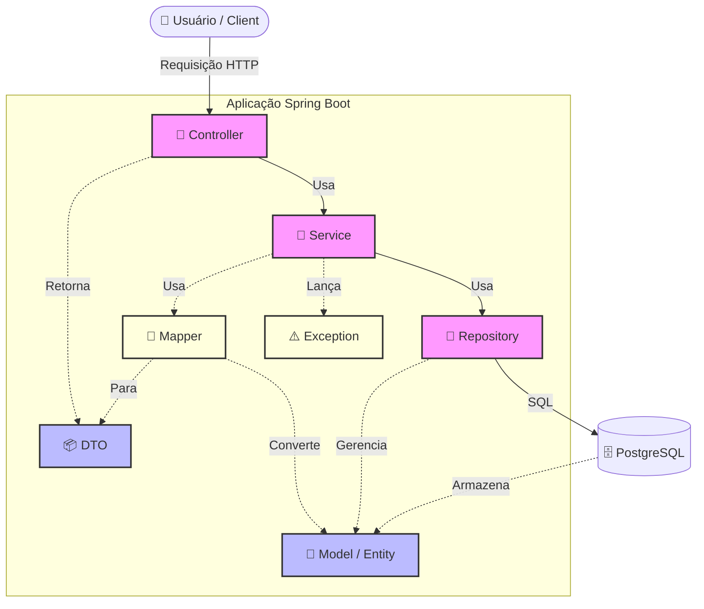

## 🏗️ Arquitetura do Backend (Spring Boot)

O projeto segue a arquitetura em camadas (**Layered Architecture**), garantindo separação de responsabilidades, testabilidade e manutenção escalável.

### Estrutura de Pacotes e Status

```text
src/main/java/com/smartenergy/api/
│
├── 📂 controller/       🚧 [TODO] Camada de API (REST Endpoints)
│   └── 📄 TarifaController.java
│
├── 📂 service/          ✅ [DONE] Regras de Negócio (Cálculo Tarifário Celesc)
│   └── 📄 TarifaCelescService.java
│
├── 📂 repository/       ✅ [DONE] Acesso a Dados (Spring Data JPA)
│   └── 📄 HotelReadingRepository.java
│
├── 📂 model/            ✅ [DONE] Entidades do Banco de Dados (ORM)
│   └── 📄 HotelReading.java
│
├── 📂 dto/              🚧 [TODO] Objetos de Transferência de Dados (JSON)
│   └── 📄 TarifaResponseDTO.java
│
├── 📂 mapper/           🚧 [TODO] Conversão Entidade ↔ DTO (Futuro)
│
└── 📂 exception/        🚧 [TODO] Tratamento Global de Erros (Futuro)
```

### Descrição das Camadas

* **Controller:** Responsável por receber as requisições HTTP (`GET`, `POST`), validar a entrada e retornar a resposta para o frontend.
* **Service:** O "cérebro" da aplicação. Contém a lógica pesada (ex: Algoritmo de Ponta/Fora de Ponta da Celesc).
* **Repository:** Interface que abstrai o SQL. Realiza operações de banco (`save`, `findAll`) usando Hibernate.
* **Model:** Representação exata das tabelas do PostgreSQL em classes Java.
* **DTO (Data Transfer Object):** Filtra o que é enviado para o usuário, protegendo a estrutura interna do banco de dados.

### Ordem de Desenvolvimento

#### 1. 🧱 Model (Entidade)
* **O que é:** O espelho da tabela do banco.
* **Por que primeiro?:** Porque é a base. Nenhuma outra camada funciona sem saber qual é o formato dos dados.
* **Status:** ✅ Feito (`HotelReading`).

#### 2. 💾 Repository
* **O que é:** O acesso ao Banco de Dados.
* **Dependência:** Precisa do `model` para saber o que buscar.
* **Status:** ✅ Feito (`TarifaCelescService`).

#### 3. 📦 DTO (Data Transfer Object)
* **O que é:** O objeto JSON simples que será enviado para o usuário.
* **Dependência:** Geralmente independente, mas criado antes do Controller para que o Controller já possa usá-lo como resposta. E antes do Mapper e do Service pois o Mapper precisa saber para quem ele vai traduzir o Model. Se o DTO não existe, o Mapper não tem destino.
* **Status:** 🚧 To-Do.

#### 4. 🔄 Mapper (O Tradutor)
* **O que é:** Converte `HotelReading` (Banco) ↔ `TarifaResponseDTO` (JSON).
* **Dependência:** Precisa do **Model** (origem) e do **DTO** (destino).
* **Momento:** Cria-se agora para que o Service ou Controller já possam usá-lo pronto, sem ter que fazer conversão manual setIsPonta(model.get...).
* **Status:** 🚧 To-Do.

#### 5. ⚠️ Exception (O Segurança)
* **O que é:** Erros personalizados (ex: `LeituraNaoEncontradaException`).
* **Momento:** Geralmente cria-se junto com o Service.
* **Cenário:** Você está escrevendo o Service e pensa: "E se o usuário pedir uma data que não existe?". Aí você pausa o Service, cria a Exception, e volta para lançá-la (`throw new ...`).
* **Status:** 🚧 To-Do.

#### 6. 🧠 Service
* **O que é:** A regra de negócio (Cálculos, Lógica da Celesc).
* **Dependência:** Precisa do `repository` para pegar os dados brutos e calcular.
* **Status:** ✅ Feito (`TarifaCelescService`).

#### 5. 🚦 Controller
* **O que é:** A API (Endpoints URL).
* **Dependência:** É o "chefe" que coordena tudo. Ele precisa injetar o **Service** para processar o pedido e devolver um **DTO**.
* **Status:** 🚧 To-Do

#### Fluxo da Requisição (Request)



### Legenda das Dependências

**1. Quem depende de ninguém?**

* **Model:** É independente (só depende do Java/JPA).

* **DTO:** É independente (apenas dados puros).

* **Exception:** Geralmente independente.

**2. Quem depende de quem?**

* **Repository** precisa do **🧱 Model.**

* **Mapper** precisa do **🧱 Model** e do **📦 DTO**.

* **Service** precisa do **💾 Repository**, do **🔄 Mapper** e das **⚠️ Exceptions**.

* **Controller** precisa do **🧠 Service** e do **📦 DTO**.